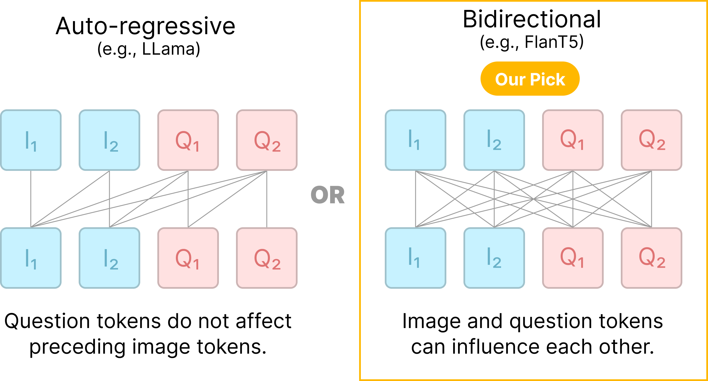

# 💬 CLIP-FlanT5: Multimodal Encoder-Decoder Language Model for VQAScore

*Evaluating text-to-image generation using VQAScore with CLIP-FlanT5! This codebase contains the training code for CLIP-FlanT5.*

[[Project Page](https://linzhiqiu.github.io/vqascore/)] [[Code for evaluation](https://github.com/linzhiqiu/t2v_metrics)]  [[Data](https://github.com/linzhiqiu/CLIP-FlanT5/blob/main/docs/Data.md)] [[Model Zoo](https://github.com/linzhiqiu/CLIP-FlanT5/blob/main/docs/MODEL_ZOO.md)]

**Evaluating Text-to-Visual Generation with Image-to-Text Generation** (Arxiv) [[Paper](https://linzhiqiu.github.io/papers/vqascore/)]<br>
[Zhiqiu Lin](https://linzhiqiu.github.io/), [Deepak Pathak](https://scholar.google.com/citations?user=AEsPCAUAAAAJ&hl=en), [Baiqi Li](www.google.com), [Jiayao Li](https://x.com/EmilyLiJiayao), [Xide Xia](www.google.com), [Graham Neubig](https://x.com/gneubig), [Pengchuan Zhang*](www.google.com), [Deva Ramanan*](https://www.cs.cmu.edu/~deva/)

## Release
- [06/13/2024] 🔥 We released training code for CLIP-FlanT5 for automated text-to-image evaluation!
<!-- - [10/11] The training data and scripts of LLaVA-1.5 are released [here](https://github.com/linzhiqiu/CLIP-FlanT5#train), and evaluation scripts are released [here](https://github.com/linzhiqiu/CLIP-FlanT5/blob/main/docs/Evaluation.md)! -->
<!-- - [10/5] 🔥 LLaVA-1.5 is out! Achieving SoTA on 11 benchmarks, with just simple modifications to the original LLaVA, utilizes all public data, completes training in ~1 day on a single 8-A100 node, and surpasses methods like Qwen-VL-Chat that use billion-scale data. Check out the [technical report](https://arxiv.org/abs/2310.03744), and explore the [demo](https://llava.hliu.cc/)! Models are available in [Model Zoo](https://github.com/linzhiqiu/CLIP-FlanT5/blob/main/docs/MODEL_ZOO.md). -->


<a href="https://linzhiqiu.github.io/papers/vqascore/"></a>

<!-- [](https://github.com/tatsu-lab/stanford_alpaca/blob/main/LICENSE)
[](https://github.com/tatsu-lab/stanford_alpaca/blob/main/DATA_LICENSE) -->
**Usage and License Notices**: The data and checkpoint is intended and licensed for research use only. They are also restricted to uses that follow the license agreement of LLaMA, Vicuna, FlanT5, and GPT-4. The dataset is CC BY NC 4.0 (allowing only non-commercial use) and models trained using the dataset should not be used outside of research purposes.


## Contents
- [Install](#install)
- [Model Weights](#model-weights)
- [Demo](#Demo)
- [Model Zoo](https://github.com/linzhiqiu/CLIP-FlanT5/blob/main/docs/MODEL_ZOO.md)
- [Dataset](https://github.com/linzhiqiu/CLIP-FlanT5/blob/main/docs/Data.md)
- [Train](#train)
- [Evaluation](#evaluation)

## Install

We follow LLaVA-1.5 for installation. If you already installed the environment from LLaVA, there is no need to create a new environment.

1. Clone this repository and navigate to CLIP-FlanT5 folder
```bash
git clone https://github.com/linzhiqiu/CLIP-FlanT5.git
cd CLIP-FlanT5
```

2. Install Package (if you do not have llava environment installed already)
```Shell
conda create -n llava python=3.10 -y
conda activate llava
pip install --upgrade pip  # enable PEP 660 support
pip install -e .
```

3. Install additional packages for training cases (if you do not have llava environment installed already)
```
pip install -e ".[train]"
pip install flash-attn --no-build-isolation
```

4. Install huggingface_hub
```
python -m pip install huggingface_hub
```

### Upgrade to latest code base

```Shell
git pull
pip install -e .
```

## CLIP-FlanT5 Weights
Please check out our [Model Zoo](https://github.com/linzhiqiu/CLIP-FlanT5/blob/main/docs/MODEL_ZOO.md) for public CLIP-FlanT5 checkpoints.

## Train

CLIP-FlanT5 consists of two stages: (1) feature alignment stage: use LLaVA-1.5 558K subset of the LAION-CC-SBU dataset to connect a *frozen pretrained* vision encoder to a *frozen FlanT5*; (2) vqa finetuning stage: use 150K LLaVA-chat data and around 515K VQA data from academic-oriented tasks.

CLIP-FlanT5 is trained on 8 A100 GPUs with 80GB memory. To train on fewer GPUs, you can reduce the `per_device_train_batch_size` and increase the `gradient_accumulation_steps` accordingly. Always keep the global batch size the same: `per_device_train_batch_size` x `gradient_accumulation_steps` x `num_gpus`.

### Hyperparameters
We use a similar set of hyperparameters as LLaVA-1.5 in finetuning.  Both hyperparameters used in pretraining and finetuning are provided below.

1. Pretraining

| Hyperparameter | Global Batch Size | Learning rate | Epochs | Max length | Weight decay |
| --- | ---: | ---: | ---: | ---: | ---: |
| CLIP-FlanT5 | 256 | 1e-2 | 1 | 2048 | 0 |

2. Finetuning

| Hyperparameter | Global Batch Size | Learning rate | Epochs | Max length | Weight decay |
| --- | ---: | ---: | ---: | ---: | ---: |
| CLIP-FlanT5 | 96 | 2e-5 | 1 | 2048 | 0 |

### Download FlanT5 checkpoints (automatically)

The base model FlanT5, which is a strong QA model developed by Google, will be downloaded automatically when you run our provided training scripts. No action is needed.

### Pretrain (feature alignment)

You can download the 558K subset of the LAION-CC-SBU dataset with BLIP captions use in the LLaVA-1.5 paper [here](https://huggingface.co/datasets/liuhaotian/LLaVA-Pretrain) and unzip/put them under "playground/data/LLaVA-Pretrain". The final folder structure should look like:

```
playground/data/
├── LLaVA-Pretrain
│   └── blip_laion_cc_sbu_558k.json
│   └── images
```

Pretrain takes around 5 hours for CLIP-FlanT5-XXL on 8x A100 (80G) using the image resolution of 336px. It takes around 2 hours for LLaVA-v1.5-7B.

Training script with DeepSpeed ZeRO-2: [`clip-flant5-xxl-stage-1.sh`](https://github.com/linzhiqiu/CLIP-FlanT5/blob/main/scripts/v1_5/clip-flant5-xxl-stage-1.sh).

- `--mm_projector_type mlp2x_gelu`: the two-layer MLP vision-language connector.
- `--vision_tower openai/clip-vit-large-patch14-336`: CLIP ViT-L/14 336px.

If you are using slurm environment, you can also use the slurm script (by changing the default partition name to your own `#SBATCH --partition={your_own_partition}`) provided in [`clip-flant5-xxl-stage-1.slurm`](https://github.com/linzhiqiu/CLIP-FlanT5/blob/main/scripts/v1_5/clip-flant5-xxl-stage-1.slurm).

### Finetune (training for VQA)

1. Prepare data

We flattened the LLaVA-1.5 mixture of data (please download from [llava_v1_5_mix665k_flattened_multi_turn.json](https://huggingface.co/datasets/zhiqiulin/CLIP-FlanT5/blob/main/llava_v1_5_mix665k_flattened_multi_turn.json)), and also download the images from constituting datasets:

- COCO: [train2017](http://images.cocodataset.org/zips/train2017.zip)
- GQA: [images](https://downloads.cs.stanford.edu/nlp/data/gqa/images.zip)
- OCR-VQA: [download script](https://drive.google.com/drive/folders/1_GYPY5UkUy7HIcR0zq3ZCFgeZN7BAfm_?usp=sharing), **because LLaVA-1.5 uses `.jpg` format, please run [fix_ocrvqa.py](fix_ocrvqa.py) after downloading and unzipping**
- TextVQA: [train_val_images](https://dl.fbaipublicfiles.com/textvqa/images/train_val_images.zip)
- VisualGenome: [part1](https://cs.stanford.edu/people/rak248/VG_100K_2/images.zip), [part2](https://cs.stanford.edu/people/rak248/VG_100K_2/images2.zip)

After downloading all of them, organize the data as follows in `./playground/data`,

```
├── coco
│   └── train2017
├── gqa
│   └── images
├── ocr_vqa
│   └── images
├── textvqa
│   └── train_images
└── vg
    ├── VG_100K
    └── VG_100K_2
```

2. Start training!

You may download the stage-1 pretrained projectors in [Model Zoo](https://github.com/linzhiqiu/CLIP-FlanT5/blob/main/docs/MODEL_ZOO.md).

Stage-2 VQA training takes around 80 hours for CLIP-FlanT5-XXL on 8x A100 (80G), due to the increased resolution to 336px and flattening the multi-turn conversations into single-turn. It takes around 60 hours for CLIP-FlanT5-XL on 8x A100 (40G).

Training script with DeepSpeed ZeRO-3: [`clip-flant5-xxl.sh`](https://github.com/linzhiqiu/CLIP-FlanT5/blob/main/scripts/v1_5/clip-flant5-xxl.sh). Optionally, if you use slurm, then you may use [`clip-flant5-xxl.slurm`](https://github.com/linzhiqiu/CLIP-FlanT5/blob/main/scripts/v1_5/clip-flant5-xxl.slurm) (make sure to change the default slurm partition).

New options to note:

- `--version`: the prompt template / conversational style to be used. In original LLaVA-1.5, stage-1 training uses "plain" and stage-2 training uses "v1". We modify these for FlanT5's encoder-decoder architecture but keep the same system message and roles. In addition, we find that split-text training ([BLIP2-FlanT5 reference](https://arxiv.org/abs/2301.12597)) works better for stage-1 training of CLIP-FlanT5. We recommend using "t5_plain_split_text" for stage-1 training, and "t5_v1" for stage-2 training.
- `--mm_projector_type mlp2x_gelu`: we use the two-layer MLP vision-language connector following LLaVA-1.5.
- `--vision_tower openai/clip-vit-large-patch14-336`: CLIP ViT-L/14 336px.
- `--image_aspect_ratio pad`: this pads the non-square images to square, instead of cropping them; LLaVA-1.5 uses it to slightly reduce hallucination.
- `--group_by_modality_length True`: LLaVA-1.5 uses this because their instruction tuning dataset contains both language (e.g. ShareGPT) and multimodal (e.g. LLaVA-Instruct). It makes the training sampler only sample a single modality (either image or language) during training, which we observe to speed up training by ~25%, and does not affect the final outcome.

## Evaluation

Please refer to the [t2v_metrics](https://github.com/linzhiqiu/t2v_metrics) repo which contains evaluation code for VQAScore using CLIP-FlanT5.

## Citation

If you find it useful for your research and applications, please cite using this BibTeX:
```bibtex
@article{lin2024evaluating,
    title={Evaluating Text-to-Visual Generation with Image-to-Text Generation},
    author={Lin, Zhiqiu and Pathak, Deepak and Li, Baiqi and Li, Jiayao and Xia, Xide and Neubig, Graham and Zhang, Pengchuan and Ramanan, Deva},
    journal={arXiv preprint arXiv:2404.01291},
    year={2024}
}
```

## Acknowledgement
- [LLaVA-1.5](https://github.com/haotianliu/LLaVA/): the codebase we built upon.